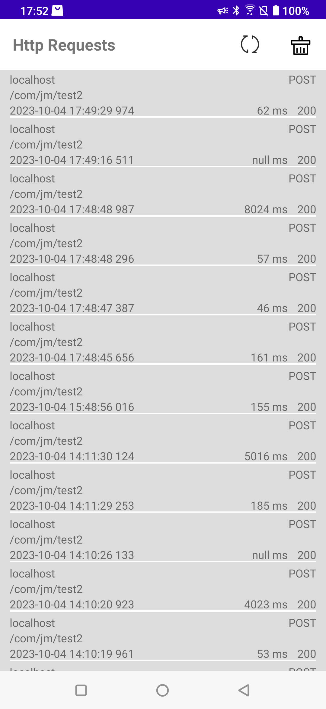
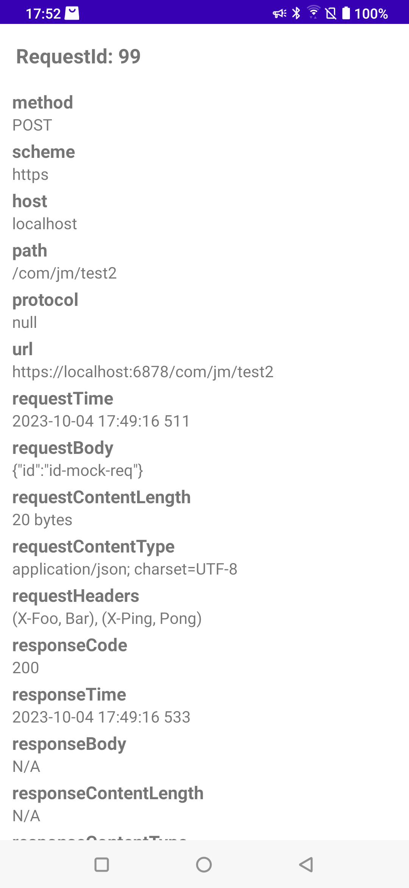

## Android网络工具系列--网络抓包
在Android日常开发中， 网络问题总是错综复杂，时常出现问题的时候又没有加上对应日志或者日志。因此在网上兜兜转转，发现[掘金][zhuabao] 上的文章，同时结合自己的业务以及几天的研究，有了如今这个抓包组件的问世
通过使用本组件，我们可以方便的将每一次请求缓存到本地，查看所有请求以及查看其次请求的详细情况

程序运行截图：




**目前推荐的使用环境：**
- android studio: Android Studio Giraffe | 2022.3.1
- agp: 8.0.2
- kotlin: 1.8.22
- gradle: 8.1.1


#### 接入步骤
1. 在app的build.gradle中引入组件库
```kts
dependencies {
    debugImplementation("io.github.jiangjm424:httpmonitor:+")
}
```

2. 在我们的网络模块中添加工具类
```kotlin

object HttpMonitorUtil {
    private const val clazz_http_monitor = "jm.droid.lib.httpmonitor.core.HttpMonitorInterceptor"
    private val supported = try {
        Class.forName(clazz_http_monitor)
        true
    } catch (ex: Exception) {
        false
    }

    fun httpMonitor(builder: OkHttpClient.Builder) {
        if (supported) {
            val interceptor = Class.forName(clazz_http_monitor).newInstance() as Interceptor
            builder.addInterceptor(interceptor)
        }
    }
}
```
3. 配置OkHttpClient.Builder中的拦截器。
因为项目中是通过使用OkHttp的拦截器来拦截每一次请求，因此需要将我们的拦截器配置到OkHttp中。通过第二步骤中的工具类，HttpMonitorUtil.httpMonitor(builder)
传入我们的OkHttpClient.Builder即可
```kotlin
private val httpClient by lazy {
val builder = OkHttpClient.Builder()
HttpMonitorUtil.httpMonitor(builder)
builder.connectTimeout(10, TimeUnit.SECONDS)
    .readTimeout(10, TimeUnit.SECONDS)
    .sslSocketFactory(createUnsafeSocketFactory(), unsafeTrustAllCerts[0])
    .hostnameVerifier { _, _ -> true }
    .build()
}
```
通过以上简单的几个步骤，httpmonitor即集成完成了，此时编译debug版本并安装后，会在桌面出现httpmonitor的应用图标，点击进入后即可以查看后续的网络请求了。
如果有不明白的地方，可以参考app/src/main/java/jm/droid/sample/mockserver/retrofit/NetApiHelper.kt的代码来实现

目前还只支持gson的数据，后续的话还会继续将一些解析能力提供出来，供使用方能方便的解析自己的协议并展示出来

如果对你有用的话，欢迎点赞加关注哦^_^

[zhuabao]: https://juejin.cn/post/7119083753376317448
